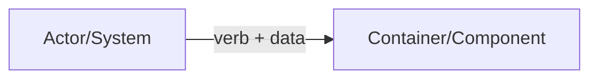

# <Spec Title>

Status: Draft | Proposed | Accepted | Implemented
Owner: <you/role>
Last updated: YYYY-MM-DD

Keep this document short. Delete sections that do not apply.

## Summary
(1–5 sentences: what + why + scope.)

## Risk
Low / Medium / High

High risk includes new public surface, data migrations, auth/authz changes, trust-boundary changes,
new persistence invariants, significant perf/latency impact.

If Risk is High:
- Monitoring signals and rollback MUST be explicit.
- Ask before proceeding from spec to implementation.

## Related ADRs
None | ADR-#### (<title>)

## Context
What exists today? What problem are we solving? Constraints that matter.

## Goals
- …

## Non-goals
- …

## Public surface changes
Required. List any new/changed public surfaces. If none, write “None”.

Public surface includes endpoints/RPC, event schemas/topics, CLI flags/commands, config semantics,
persistence formats/migrations, and entrypoint exports.

- Endpoints/RPC:
- Events/schemas:
- CLI:
- Config semantics:
- Persistence format/migration:
- Entrypoint exports:
- Intentionally not supported (surface area control):

## Architecture (C4) — Mermaid-in-Markdown only
Use the smallest C4 level(s) that clarify the change (L1/L2/L3).
No box soup: every box MUST have a responsibility; every relationship MUST be labeled.

## Proposed design
Bullets. Include only what is needed to implement/review safely.

### Responsibilities and boundaries
- Components/containers and their responsibilities:
- Dependency direction:
- Key invariants:

### Data flow and trust boundaries
Delete this section if not relevant.
- Untrusted inputs:
- Validation points:
- Sensitive data handling:
- Failure modes:

## Contract requirements
Use MUST/SHOULD/MAY only for behavioral/contract requirements (not narrative).
- MUST …
- MUST NOT …
- SHOULD …
- MAY …

## Compatibility and migrations
Delete this section if not applicable.
- Backwards compatibility expectations:
- Migration plan:
- Rollback implications:

## Security considerations
Delete this section only if clearly not relevant.
- Threats:
- Mitigations:
- Residual risk:

## High risk addendum
Delete this entire section if Risk is not High.

### Observability and operability
- Monitoring signals (what proves it is healthy?):
- Logs (what matters; what must not be logged):
- Metrics/traces (if applicable):
- Alerting (if applicable):

### Rollout and rollback
- Rollout steps:
- Rollback strategy:
- Feature flags/config (avoid new flags unless necessary):

## Reduction pass
Required.
How does this reduce or avoid expanding surface area?
- Avoided options/modes:
- Consolidated paths:
- Simplified invariants:
- If no simplification is viable without changing requirements/compatibility, say why:

## Alternatives considered
Brief.
- Alternative:
  - Why not:
- Alternative:
  - Why not:

## Acceptance criteria
Required.
- Tests (map to goals; include negative cases where relevant):
- Observable behavior:
- Performance/SLO constraints (if any):
