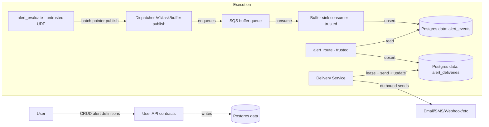

# Alerting

Status: Draft
Owner: Platform
Last updated: 2026-01-02

## Summary
Alerting lets users define rules over Trace data and receive notifications. Untrusted alert evaluation code emits **alert events**; routing jobs transform events into **delivery work items**; the **Delivery Service** is the only component that performs outbound sends and records outcomes.

## Risk
Medium

## Problem statement
Users need near-real-time and historical alert evaluation over blockchain datasets, with safe retries, reorg awareness, and centralized delivery so untrusted code cannot exfiltrate data or spam external systems.

Constraints:
- At-least-once execution (task retries, duplicate buffer publishes, duplicate delivery attempts).
- Untrusted evaluation logic (UDF) must not have network egress or direct database credentials.
- Multi-tenant correctness: all data and notifications are scoped to an org.

## Goals
- Allow users to create/modify alert definitions and evaluate them over live + historical data.
- Ensure **idempotent event ingestion** (duplicate evaluations do not create duplicate `alert_events`).
- Ensure **at-least-once delivery** without uncontrolled spam (delivery idempotency and per-channel throttling).
- Keep untrusted code isolated: evaluation reads via Query Service and writes via task-scoped APIs only.

## Non-goals
- Exactly-once delivery to external providers.
- Arbitrary outbound networking from user-provided code.
- A full rules engine language in v1 (condition format is opaque to the platform aside from validation).

## Public surface changes
Public surface includes API endpoints, schemas, config semantics, and persistence formats.

- Endpoints/RPC: Alert CRUD + delivery status endpoints (see `docs/architecture/user_api_contracts.md`); task buffer publish for `alert_events` (see `docs/architecture/contracts.md`).
- Events/schemas: `alert_events` buffered dataset batch format (see `docs/adr/0006-buffered-postgres-datasets.md`).
- CLI: None.
- Config semantics: DAG jobs `alert_evaluate` and `alert_route` (see `docs/specs/dag_configuration.md` and operator docs).
- Persistence format/migration: Postgres data tables `alert_definitions`, `alert_events`, `alert_deliveries` (DDL in `docs/architecture/data_model/alerting.md`).
- Intentionally not supported (surface area control): direct webhook calls from UDFs; custom provider integrations inside UDF runtime.

## Architecture (C4) - Mermaid-in-Markdown only

## Proposed design

### Responsibilities and boundaries
- **Alert definitions** live in Postgres data (`alert_definitions`). They are owned by an org and created by a user.
- **Evaluation** runs as **untrusted code** and may be deployed on Lambda (v1) or other untrusted runtimes later.
  - Evaluation reads required inputs via Query Service with a **capability token**.
  - Evaluation emits alert events via the **task-scoped** buffer publish API (`/v1/task/buffer-publish`) using a pointer-to-batch artifact (S3).
- **Routing** is trusted operator code that:
  - reads `alert_events`,
  - applies routing filters (channels, throttles, staleness gating),
  - creates/updates `alert_deliveries` rows.
- **Delivery Service** is the only outbound-integrated component. It:
  - leases pending deliveries,
  - performs the send,
  - records outcomes and retry metadata.

### Alert event batch artifact format (v1)

Alert evaluation publishes a pointer (`batch_uri`) to an object-store artifact. v1 uses **JSON Lines** (`.jsonl`): one JSON object per line, UTF-8.

Record schema (v1):

Required:
- `alert_definition_id` (UUID)
- `dedupe_key` (string) - deterministic, stable across retries
- `event_time` (RFC3339 timestamp)

Optional (recommended when available):
- `severity` (`info`|`warning`|`critical`)
- `chain_id` (int)
- `block_number` (int)
- `block_hash` (string)
- `tx_hash` (string)
- `source_dataset_uuid` (UUID)
- `partition_key` (string)
- `cursor_value` (string)
- `payload` (object) - producer-defined details (the only extensible field)

Note: the platform normalizes common chain context fields (`chain_id`, `block_number`, `block_hash`, `tx_hash`) into dedicated columns for indexing. Producers MAY also copy these values into `payload` for convenience; the sink does not validate or interpret `payload` beyond being a JSON object.

Rules:
- Top-level unknown fields are rejected (use `payload` for extensions).
- Tenant attribution is not trusted from payload; the sink assigns `org_id` and producer ids from the trusted publish record.

Validation + refusal behavior:
- The sink consumer MUST validate the batch artifact strictly. If any row fails to parse or violates the schema, the entire batch is rejected and the message is dead-lettered (no partial writes).
- This is intentional: malformed alert outputs should fail loudly, not corrupt data silently.

### Idempotency and retries

General buffered dataset idempotency rules are defined in [ADR 0006](../adr/0006-buffered-postgres-datasets.md#idempotency-requirements). Alerting-specific bindings:

- `alert_events` MUST be idempotent via a deterministic `dedupe_key`. The table enforces `UNIQUE (org_id, dedupe_key)`. See `docs/architecture/data_model/alerting.md`.
- `alert_deliveries` MUST be idempotent per channel via `UNIQUE (org_id, alert_event_id, channel)`.
- Delivery semantics are at-least-once: providers may see duplicates on timeouts; include a stable provider idempotency key where supported (use `alert_deliveries.id`).

### Deduplication

Alert events are at-least-once. Producers and sinks MUST tolerate duplicates.

- Each emitted alert event MUST include a deterministic `dedupe_key` that is **stable across retries/attempts**.
- The `dedupe_key` MUST be derived from event identity (e.g., `{alert_definition_id, partition_key, tx_hash}`) or a stable hash of canonicalized event content.
- The sink enforces idempotency with a uniqueness constraint (see `docs/architecture/data_model/alerting.md`).

### Reorg / invalidation behavior
- Reorg-safe producers should include reorg-relevant identifiers in the `dedupe_key` and event payload (e.g., `block_hash`).
- Reorg correction uses the platform’s invalidation/versioning mechanisms (see `docs/architecture/data_versioning.md`). Alert routing should apply staleness gating based on `event_time` and/or cursor state.

## Contract requirements
- UDF evaluation code MUST be treated as untrusted, even if executed on Lambda.
- Evaluation MUST NOT have outbound network egress to third parties; only Delivery Service sends externally.
- Producers MUST publish alert events via `/v1/task/buffer-publish` using the pointer pattern (no embedded record batches in SQS messages).
- Each alert event MUST include a deterministic `dedupe_key` that is stable across retries.
- Routing MUST write deliveries idempotently (upsert by `(org_id, alert_event_id, channel)`).
- Delivery MUST be lease-based and crash-safe; multiple instances may run concurrently.

## Security considerations
- Threats: UDF exfiltration; spamming channels; cross-tenant delivery; replaying buffer publishes.
- Mitigations:
  - Task-scoped capability tokens for Query Service access; no direct DB creds for UDFs.
  - Delivery centralized behind a trusted service boundary.
  - Idempotency keys enforced in Postgres.
  - TLS for all calls carrying tokens or payloads.
- Residual risk: external providers may still deliver duplicates on timeout; mitigated with provider dedupe keys where supported.

## Alternatives considered
- Let evaluation UDFs call webhooks directly.
  - Why not: breaks zero-trust model; cannot enforce rate limits, auditing, or SSRF protection centrally.
- Use exactly-once messaging for alert events.
  - Why not: increases surface area; at-least-once + idempotency is sufficient and matches platform assumptions.

## Acceptance criteria
- Tests:
  - Duplicate buffer publish of the same event batch results in one `alert_events` row (per `dedupe_key`).
  - Duplicate routing runs do not create duplicate deliveries.
  - Delivery retries update a single delivery row and do not create duplicates.
  - Cross-tenant isolation: one org’s events cannot create deliveries for another org.
- Observable behavior:
  - Delivery queue depth, lease contention, and provider error rates are visible.
- Performance/SLO constraints:
  - Routing and delivery should keep up with typical alert rates without unbounded backlog growth.
