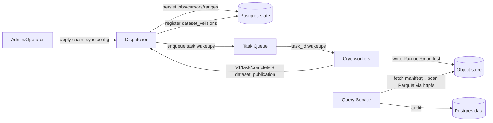

# Chain Sync entrypoint (genesis → tip, multi Cryo datasets)

Status: Draft
Owner: Platform
Last updated: 2026-01-11

Keep this document short. Delete sections that do not apply.

## Summary
Define a declarative `chain_sync` entrypoint that syncs one or more Cryo datasets (e.g., `blocks`, `logs`, `geth_calls`) from genesis to tip. The Dispatcher owns all planning/scheduling (no shell loops) using durable Postgres state, leased tasks, and idempotent dataset publication so outputs remain safely queryable via Query Service remote Parquet scans.

## Doc ownership

This spec defines:
- The admin-only `chain_sync` job surface and apply semantics.
- Planner invariants and required durable state (per-stream cursors and scheduled range ledger).
- The required task payload contract for `cryo_ingest` tasks planned by `chain_sync`.

This spec depends on (and does not restate):
- Task lifecycle, leasing, and fencing: [task_lifecycle.md](../architecture/task_lifecycle.md) and [task_scoped_endpoints.md](../architecture/contracts/task_scoped_endpoints.md)
- Range semantics and invalidations: [data_versioning.md](../architecture/data_versioning.md)
- Query Service fail-closed behavior: [query_sql_gating.md](query_sql_gating.md), [query_service_task_query.md](query_service_task_query.md), and [Query Service container](../architecture/containers/query_service.md)
- `cryo_ingest` worker behavior: [operators/cryo_ingest.md](operators/cryo_ingest.md)

## Risk
High

High risk includes new public surface, data migrations, auth/authz changes, trust-boundary changes,
new persistence invariants, significant perf/latency impact.

If Risk is High:
- Monitoring signals and rollback MUST be explicit.
- Ask before proceeding from spec to implementation.

## Related ADRs
- [ADR 0002](../adr/0002-networking.md) - networking and egress allowlist
- [ADR 0008](../adr/0008-dataset-registry-and-publishing.md) - dataset registry and publishing
- [ADR 0009](../adr/0009-atomic-cutover-and-query-pinning.md) - atomic cutover and query pinning

## Context
Today, Lite bootstrap sync is proven via:
- `cryo_ingest` producing Parquet + a Trace-owned manifest under a deterministic version-addressed prefix (ms/12),
- `dataset_versions` registered in Postgres state idempotently on task completion, and
- ms/13's Lite bootstrap planner (`plan-chain-sync`) which scheduled bounded ranges but required an external caller to re-run it and planned only a single dataset stream per invocation.
  - This approach is superseded by the system-managed `chain_sync` job runner and `trace-dispatcher apply --file <spec.yaml>` (ms/16).

Problem statement:
Users want to specify “sync this chain” once and have the system run to completion (or continuously follow head) across multiple Cryo datasets, without external planning loops. The outputs must remain queryable via Query Service while preserving the existing sandbox and security invariants (capability tokens, dataset grants, remote Parquet scan, fail-closed behavior).

Constraints that matter:
- Task execution is at-least-once; duplicates and restarts are expected (see [task_lifecycle.md](../architecture/task_lifecycle.md)).
- Planning is system-managed: workers must not decide retries or scheduling (see [invariants.md](../architecture/invariants.md)).
- Range semantics are start-inclusive and end-exclusive (see [task_scoped_endpoints.md](../architecture/contracts/task_scoped_endpoints.md)).
- Query Service must remain fail closed for untrusted SQL (see [query_sql_gating.md](query_sql_gating.md) and [query_service_task_query.md](query_service_task_query.md)).
- Chain datasets have no required relational schema in v1; Parquet is canonical (see [ingestion.md](ingestion.md)).

## Goals
- Provide a declarative, reviewable configuration for “sync chain from genesis → tip” that can include multiple Cryo datasets in one job.
- Make planning internal: Dispatcher continuously “tops up” in-flight work up to a configured bound (no external loop).
- Persist progress durably and monotonically via per-(chain_id, dataset_key) cursors.
- Ensure idempotency:
  - re-planning does not create duplicate effective work for the same range, and
  - task retries do not double-register dataset versions.
- Support dataset-specific RPC pools (e.g., `geth_calls` uses trace-enabled providers).

## Non-goals
- Reorg-safe “follow head” semantics beyond a minimal head observation and bounded tail window (full reorg handling is a separate operator concern).
- Cross-dataset joins or schema enforcement at ingestion time.
- Public user APIs for starting/stopping sync (this spec defines an admin surface only).
- Exactly-once scheduling or exactly-once ingestion.

## Public surface changes
Required. List any new/changed public surfaces. If none, write “None”.

Public surface includes endpoints/RPC, event schemas/topics, CLI flags/commands, config semantics,
persistence formats/migrations, and entrypoint exports.

- Endpoints/RPC:
  - Admin-only: apply/pause/resume/status for `chain_sync` jobs (shape TBD; see “API surface”).
- Events/schemas:
  - Task payload schema for `cryo_ingest` tasks planned by `chain_sync` MUST include:
    - `chain_id` (int)
    - `dataset_key` (string)
    - `dataset_uuid` (uuid)
    - `cryo_dataset_name` (string)
    - `rpc_pool` (string)
    - `range_start` (int)
    - `range_end` (int, end-exclusive in payload terms)
    - `config_hash` (string)
- CLI:
  - Admin-only: `trace-dispatcher apply --file <path>`, `trace-dispatcher status [--job <job_id>]`, and `trace-dispatcher chain-sync pause|resume --org-id <uuid> --name <job_name>`.
- Config semantics:
  - Admin-only `chain_sync` job spec YAML applied via `trace-dispatcher apply --file <job.yaml>` (separate from the DAG YAML jobs list).
- Persistence format/migration:
  - Postgres *state* requires durable `chain_sync` job definitions + per-stream cursors + scheduled range ledger (semantic model in this spec; SQL not designed here).
- Entrypoint exports:
  - None.
- Intentionally not supported (surface area control):
  - External shell loop planners.
  - User SQL referencing any Parquet paths/URLs directly (Query Service continues to attach relations in trusted code).

## Architecture (C4) - Mermaid-in-Markdown only
Use the smallest C4 level(s) that clarify the change (L1/L2/L3).
No box soup: every box MUST have a responsibility; every relationship MUST be labeled.



## Proposed design
Bullets. Include only what is needed to implement/review safely.

### Concepts / definitions (enforceable)
- Entrypoint: `chain_sync`.
- Dataset stream: `{ job_id, dataset_key }`.
  - `dataset_key` is a stable stream key chosen in YAML (slug; `^[a-z0-9_]{1,64}$`).
  - `cryo_dataset_name` selects the Cryo dataset invoked by tasks in this stream (slug; `^[a-z0-9_]{1,64}$`).
  - Each dataset stream maps to exactly one published dataset UUID in the dataset registry (resolution is part of “apply”).
- Partition/range: block interval planned by `chain_sync` (see Range semantics).
- Task: one `{ dataset_key, chain_id, dataset_uuid, range, rpc_pool }` planned unit of work.
  - `rpc_pool` selects an RPC pool owned by the RPC Egress Gateway (API keys are not in YAML).
  - `dataset_uuid` is inserted into the task payload by the Dispatcher at planning time after apply-time resolution.
  - **Single-output rule (v1):** a task attempt is defined to produce **exactly one** `DatasetPublication`.
    - A completion payload that contains zero publications or attempts to publish more than one publication is malformed and MUST be rejected by the Dispatcher.
    - Multi-output tasks (e.g., “one task runs Cryo for blocks+logs+traces in one invocation”) are intentionally not supported in v1 because they couple failure domains and break retry/idempotency invariants.
- DatasetPublication: on successful task completion, a single dataset version publication describing:
  - `{ dataset_uuid, dataset_version, storage_ref, config_hash, range_start, range_end }`.
- Cursor: per `{ job_id, dataset_key }` exclusive high-water mark `next_block` for planning.
- Tip mode:
  - `fixed_target`: plan from `from_block` until `cursor >= to_block`, then complete.
  - `follow_head`: continuously plan as head advances; does not “complete”.

### Range semantics
- All block ranges are start-inclusive and end-exclusive: `[range_start, range_end)`.
- `cryo_ingest` MUST invoke Cryo as `--blocks {range_start}:{range_end}` (do not pre-decrement).
- Canonical owners: [task_scoped_endpoints.md](../architecture/contracts/task_scoped_endpoints.md), [data_versioning.md](../architecture/data_versioning.md), and [operators/cryo_ingest.md](operators/cryo_ingest.md).

### Semantics / invariants (non-negotiable)
- No external planning loops: Dispatcher continuously tops up in-flight work for each active `chain_sync` job.
- Multiple datasets per job are supported: a single `chain_sync` job definition contains N dataset streams.
- **Each successful task completion MUST include exactly one dataset publication.**
  - The Dispatcher MUST reject completion if the publication is missing or if the completion attempts multiple publications.
- Different dataset streams MAY use different `rpc_pool` values.
- Idempotency:
  - Re-planning MUST NOT create duplicate scheduled ranges for the same `{job_id, dataset_key, range}` (enforced by a uniqueness constraint).
  - Task retries MUST NOT double-register dataset versions (enforced by deterministic `dataset_version` and/or registry uniqueness; conflicts must match or fail).
- Completion:
  - `fixed_target`: a job is complete iff for every dataset stream: `cursor >= to_block` AND there are zero in-flight scheduled ranges.
  - `follow_head`: the job never completes; it maintains an in-flight window relative to observed head.
- Queryability:
  - Every dataset publication MUST resolve to a `storage_ref` that Query Service can attach remotely (no Parquet downloads by Query Service).
- Security:
  - Query Service safety and egress restrictions are owned by Query Service docs; see [query_sql_gating.md](query_sql_gating.md), [query_service_task_query.md](query_service_task_query.md), [Query Service container](../architecture/containers/query_service.md), and [ADR 0002](../adr/0002-networking.md).

### Planner algorithm (internal, restart-safe)
For each active `chain_sync` job, Dispatcher runs a loop (periodic, e.g. every few seconds):
1) Load the job definition and its dataset stream configs.
2) For each dataset stream, compute an eligible planning window:
   - `fixed_target`: `to_block` is fixed.
   - `follow_head`:
     - If head is missing or stale, planning MUST skip for that stream (fail closed) rather than guessing.
     - Observed head MUST be read from `chain_head_observations` for the stream's `{org_id, chain_id, rpc_pool}`.
     - Use end-exclusive math:
       - `to_block = max(from_block, (observed_head + 1) - tail_lag)`
3) While `inflight_count(stream) < max_inflight(stream)` and `cursor(stream) < to_block`:
   - compute next `[start,end)` by `chunk_size`.
   - atomically insert a scheduled-range row keyed by `{job_id, dataset_key, range_start, range_end}`.
     - If it already exists, skip (idempotency).
   - atomically create (or fetch) a task row keyed by the same range (task dedupe key).
   - write an outbox wakeup for that task.
   - advance the cursor to `end` in the same transaction as recording the scheduled range + enqueue outbox.

### Completion semantics for scheduled ranges
- A scheduled range moves `scheduled → completed` only when the corresponding task attempt completes successfully and its dataset publication is accepted (attempt-fenced).
- Failed/expired attempts do not advance completion; retries reuse the same task id and scheduled range record.

### State model (semantic; not SQL)
The following durable state is required in Postgres *state* (naming is illustrative):
- Sync job definition (`chain_sync_jobs`):
  - Identity:
    - `job_id` (stable UUID)
    - `(org_id, name)` unique key (apply idempotency)
  - Core fields:
    - `org_id` (uuid)
    - `name` (string)
    - `chain_id` (int)
    - `enabled` (bool)
    - `mode` (`fixed_target|follow_head`)
    - `from_block` (int)
    - `to_block` (int, nullable for follow head)
    - defaults: `chunk_size`, `max_inflight`
  - Follow-head fields:
    - `tail_lag` (int blocks)
    - `head_poll_interval_seconds` (int)
    - `max_head_age_seconds` (int)
  - Audit/debug:
    - `yaml_hash` (string; change detector only)
    - `updated_at`
    - `last_error` (optional category, redacted message)
- Stream definitions (`chain_sync_streams`):
  - key: `{job_id, dataset_key}`
  - fields:
    - `dataset_key` (string)
    - `cryo_dataset_name` (string)
    - `rpc_pool` (string)
    - derived identity: `dataset_uuid` (uuid, deterministic from `{org_id, chain_id, dataset_key}`)
    - `config_hash` (string)
    - per-stream overrides: `chunk_size`, `max_inflight`
- Per-stream cursor (`chain_sync_cursor`):
  - key: `{job_id, dataset_key}`
  - fields:
    - `next_block` (exclusive high-water mark)
    - `updated_at`
- Scheduled range ledger (`chain_sync_scheduled_ranges`):
  - key: `{job_id, dataset_key, range_start, range_end}`
  - fields:
    - `task_id` (stable mapping to the planned task)
    - `status` (`scheduled|completed`)
    - `created_at`, `updated_at`
  - uniqueness: `(job_id, dataset_key, range_start, range_end)` MUST be unique
- Optional head observation (`chain_head_observations`):
  - key: `{org_id, chain_id, rpc_pool}`
  - `head_block` and `observed_at`
  - `source` (e.g., rpc_pool) for debugging only

### API surface (admin-only; proposal)
This spec defines the minimum required operations; concrete endpoint/CLI names are not final.

Operations:
- Apply spec (YAML): creates/updates a `chain_sync` job definition.
  - Apply MUST be idempotent by `(org_id, job name)` (or an explicit `job_id`).
  - `yaml_hash` is stored as a change detector and audit value, not the identity.
- Pause/resume: flips job status; planner loop must stop scheduling new work when paused.
- Status/progress:
  - per dataset stream cursor (`next_block`)
  - inflight scheduled count
  - last error category + timestamp (no secrets)
  - head observed timestamp (if follow head mode)

### Chain sync job YAML (v1)

`chain_sync` jobs are defined in a standalone YAML document applied by an admin via `trace-dispatcher apply --file <job.yaml>`.

Schema (v1):
- `kind: chain_sync`
- `name`: stable job name (unique per org)
- `chain_id`: positive int
- `mode`:
  - `fixed_target`: `{ from_block, to_block }` where `to_block` is end-exclusive
  - `follow_head`: `{ from_block, tail_lag, head_poll_interval_seconds, max_head_age_seconds }`
- `streams`: mapping from `dataset_key` to:
  - `cryo_dataset_name`, `rpc_pool`, `chunk_size`, `max_inflight`

Constraints:
- YAML MUST NOT contain secrets, including RPC URLs, API keys, or object store credentials.
- YAML MUST reference RPC pools by name only (`rpc_pool: traces`), never by URL.
- `dataset_key` and `cryo_dataset_name` MUST match `^[a-z0-9_]{1,64}$`.
- `dataset_uuid` is not provided in YAML; it is derived deterministically from `{org_id, chain_id, dataset_key}` at apply-time.

Examples:
- Bootstrap: [chain_sync.monad_mainnet.yaml](../examples/chain_sync.monad_mainnet.yaml)
- Follow-head:
```yaml
kind: chain_sync
name: mainnet_follow
chain_id: 1

mode:
  kind: follow_head
  from_block: 0
  tail_lag: 64
  head_poll_interval_seconds: 5
  max_head_age_seconds: 30

streams:
  blocks:
    cryo_dataset_name: blocks
    rpc_pool: standard
    chunk_size: 2000
    max_inflight: 40
```

Notes:
- This spec is intentionally separate from the DAG YAML jobs list; full DAG composition is out of scope for v1.

## Contract requirements
Use MUST/SHOULD/MAY only for behavioral/contract requirements (not narrative).
- The Dispatcher MUST be the only component that performs planning/scheduling for `chain_sync` (no external loops).
- The Dispatcher MUST persist progress per `{chain_id, dataset_key}` as a monotonic cursor (`next_block`) and MUST NOT move it backwards.
- The planner MUST be idempotent under restart: inserting scheduled ranges MUST be protected by a uniqueness constraint and safe retries (`ON CONFLICT DO NOTHING` or equivalent).
- Each planned range MUST map to a stable task identity (dedupe key) so duplicate scheduling does not create divergent work.
- Workers MUST NOT register dataset versions directly; they MUST publish dataset publications only via fenced `/v1/task/complete`.
- For `cryo_ingest` tasks, `/v1/task/complete` MUST carry **exactly one** dataset publication object and it MUST match the task payload `{chain_id, dataset_key, dataset_uuid, range_start, range_end}`.
  - The completion's `dataset_publication.dataset_uuid` MUST equal the payload's `dataset_uuid`.
  - The Dispatcher MUST reject completions that omit the publication or attempt to include multiple publications (even if identical).
  - The Dispatcher MUST NOT partially accept a subset of publications.
- Dataset version registration MUST be idempotent: if a dataset version insert conflicts, the stored `{storage_ref, config_hash, range}` MUST match exactly or the completion MUST fail (no silent divergence).

## Compatibility and migrations
- ms/13's `plan-chain-sync` CLI is deprecated and not available on `main`.
- Use `trace-dispatcher apply --file <spec.yaml>` to create/update `chain_sync` jobs; the Dispatcher owns planning and continuously tops up work.

## Security considerations
- Threats:
  - Planner drift causes duplicate/overlapping ranges that produce inconsistent dataset version registry state.
- Mitigations:
  - Query Service safety and remote Parquet scan egress restrictions are owned by Query Service docs; see [query_sql_gating.md](query_sql_gating.md), [Query Service container](../architecture/containers/query_service.md), and [ADR 0002](../adr/0002-networking.md).
  - Scheduled-range uniqueness + deterministic dataset versioning at the registry boundary; reject divergence on conflict.
- Residual risk:
  - Validator denylist incompleteness; mitigated by defense-in-depth and tests.

## High risk addendum
### Observability and operability
- Monitoring signals:
  - Per stream: `cursor.next_block` vs `to_block` (fixed) or vs observed head (follow)
  - Inflight count and scheduled backlog per stream
  - Task failure rate by error category (RPC/Cryo/object-store)
  - Query Service denials (validate_sql rejects) and attach failures
- Logs:
  - MUST NOT log raw SQL in Query Service paths.
  - MUST redact secrets (RPC keys, object-store secrets); errors are categorized.

### Rollout and rollback
- Rollout:
  - Introduce `chain_sync` apply via admin-only `trace-dispatcher apply --file`; do not route via Gateway.
  - Implement fixed-target first; follow-head mode is feature-complete only when head observation is implemented.
- Rollback strategy:
  - Pause the job (stop scheduling) without deleting state.
  - If required, re-apply a fixed-target spec with an explicit bound; avoid manual scheduling loops.

## Reduction pass
Required.
How does this reduce or avoid expanding surface area?
- Avoided options/modes:
  - No external planning loops; no bespoke per-user scripts.
  - No per-job IAM policy modeling in YAML; RPC pools are referenced, not embedded.
- Consolidated paths:
  - Reuses existing leased task lifecycle, outbox, and dataset version publication instead of inventing a new scheduler.
- Simplified invariants:
  - Single cursor + scheduled range ledger per stream; deterministic dataset version boundary.

## Alternatives considered
Brief.
- Alternative: keep planning as an external CLI loop (ms/13-style planner) and document runbooks.
  - Why not: it is operationally fragile and violates “system manages planning internally”.
- Alternative: embed `chain_sync` as a first-class entrypoint inside DAG YAML.
  - Why not: expands DAG YAML surface area and makes v1 composition rules ambiguous.
- Alternative: fully express chain sync as a generic DAG with explicit `range_splitter` nodes and per-dataset ingestion nodes.
  - Why not: heavier YAML surface for the common bootstrap case; harder to keep stable for v1.

## Acceptance criteria
Required.
- Tests (map to goals; include negative cases where relevant):
  - Planner idempotency: applying the same `chain_sync` spec twice does not duplicate scheduled ranges or tasks.
  - At-least-once safety: retrying a failed range does not double-register a dataset version.
  - Single-output enforcement: a task completion that omits `dataset_publication` or attempts to publish more than one publication is rejected and MUST NOT register any dataset version.
  - UUID binding: a task completion with a mismatched `dataset_uuid` is rejected and MUST NOT register any dataset version.
  - Security: Query Service continues to reject unsafe SQL and does not allow file/URL reads from untrusted SQL.
- Observable behavior:
  - Status reports per-stream cursor and inflight counts; fixed-target completion is computed precisely.
- Performance/SLO constraints (if any):
  - Planner loop must not hot-loop; bounded periodic scheduling is sufficient for v1.
