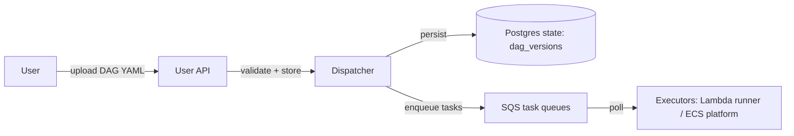

# DAG configuration and deployment

Status: Draft
Owner: Platform
Last updated: 2026-01-02

## Summary
Trace DAGs are defined as a single YAML document that declares jobs (operators + runtime + config), edges (inputs), and optional dataset publishing. The YAML is versioned; a deployed DAG version is the immutable unit of scheduling and lineage.

## Risk
Medium

## Problem statement
Users need a concise, reviewable way to define an ETL graph that supports:
- deterministic wiring of jobs,
- safe retries (at-least-once),
- explicit publishing of user-facing datasets,
- source triggers and reactive processing.

Constraints:
- DAG YAML is a **public surface** and must remain stable and minimal.
- Defaults must exist so most jobs can omit tuning knobs.
- The scheduler assumes at-least-once; the DAG format must make idempotency requirements explicit.

## Goals
- Provide a clear YAML schema that can be validated deterministically.
- Keep runtime surface area small for v1:
  - `lambda` for untrusted user code (UDF runner),
  - `ecs_platform` for trusted platform operators,
  - `dispatcher` for internal/no-op control jobs.
- Make idempotency requirements explicit for `append` outputs (`unique_key`).
- Support both source-triggered and reactive jobs.
- Support publishing selected outputs as named datasets via the dataset registry.

## Non-goals
- Arbitrary dynamic DAG generation at runtime.
- Implicit dependency inference from naming conventions.
- Per-job IAM policy definitions in YAML.
- Exactly-once execution.

## Public surface changes
- Config semantics: DAG YAML schema (this document).
- Persistence: DAG versions and the active mapping (see `docs/architecture/data_model/orchestration.md`).
- Intentionally not supported: per-job secret-slot leasing; implicit joins/fan-in behaviors.

## Architecture (C4) — Mermaid-in-Markdown only



## Proposed design

### YAML schema (v1)

```yaml
name: cross-chain-analytics

defaults:
  heartbeat_timeout_seconds: 60
  max_attempts: 3
  priority: normal
  max_queue_depth: 1000
  max_queue_age: 5m
  backpressure_mode: pause

jobs:
  - name: daily_trigger
    activation: source
    runtime: lambda
    operator: trigger_cron
    outputs: 1
    source:
      kind: cron
      schedule: "rate(1 day)"
    timeout_seconds: 60

  - name: compact_blocks
    activation: reactive
    runtime: ecs_platform
    operator: parquet_compact
    outputs: 1
    update_strategy: replace
    inputs:
      - from: { job: block_range_aggregate, output: 0 }
    execution_strategy: PerPartition
    timeout_seconds: 1800

publish:
  blocks_parquet:
    from: { job: compact_blocks, output: 0 }
    storage: s3
```

### Job fields (reference)

| Field | Required | Description |
|-------|----------|-------------|
| `name` | ✅ | Unique job name within the DAG |
| `activation` | ✅ | `source` or `reactive` |
| `runtime` | ✅ | `lambda`, `ecs_platform`, or `dispatcher` |
| `operator` | ✅ | Operator implementation identifier |
| `outputs` | ✅ | Number of outputs exposed as `output[0..N-1]` for wiring and publishing |
| `inputs` | reactive | Upstream edges (`from: {job, output}` or `from: {dataset: dataset_name}`), optionally with `where` |
| `execution_strategy` | reactive | `PerUpdate` or `PerPartition` |
| `update_strategy` | reactive | `append` or `replace` |
| `unique_key` | if append | Required when `update_strategy=append` — columns used for idempotent upserts |
| `source` | source | Source config: `kind`, `schedule`/`webhook_path`, etc. |
| `bootstrap` | source | Optional one-time bootstrap actions (v1: `reset_outputs`) |
| `secrets` | | Logical secret names required by the operator |
| `timeout_seconds` | | Hard execution timeout (platform-enforced) |
| `config` | | Operator-specific config |
| `udf` | | UDF bundle reference (required for `operator: udf` and any operator that executes user bundles) |

Notes:
- `runtime: lambda` is allowed for **untrusted** user code, but the runtime is a **platform-managed runner** (see `docs/specs/udf.md`).
- `ecs_udf` is **reserved for v2** pending a zero-trust design that prevents untrusted code from inheriting privileged AWS credentials.

### Input filters (`where`)
Reactive jobs may narrow upstream inputs with a `where` clause. The filter is applied by the platform (not user code) and must be safe/validatable.

Example:

```yaml
inputs:
  - from: { dataset: address_labels }
    where:
      chain_id: 1
      label_type: "cex"
```


### UDF jobs (optional)

Some jobs execute **user-defined bundles** (untrusted code). In v1 this is supported only with `runtime: lambda` (the platform-managed UDF runner).

- Use `operator: udf` for a generic “run this bundle” job.
- Some built-in operators (e.g., `alert_evaluate`) may also require an `udf` block to supply the user logic.

Add an `udf` block to the job:

```yaml
udf:
  bundle_id: "<bundle-id>"
  entrypoint: "trace.handler"
```

Notes:
- A single DAG may mix languages by referencing different bundles.
- Bundle language (node/python/rust) is recorded at upload time; Dispatcher selects the appropriate Lambda runner.
- For Rust custom runtime bundles, `entrypoint` is ignored (the bundle's `bootstrap` is executed).

Constraints:
- UDF jobs MUST NOT request `secrets`.
- UDF jobs MUST read only via Query Service and write only via task-scoped APIs.
- Use `update_strategy: append` + `unique_key` for idempotent sinks.


V1 constraints:
- Filters are simple equality matches on a small allowlist of fields for the referenced dataset/operator.
- No arbitrary SQL in DAG config.

### Publish fields (optional)
Publishing registers a job output as a named dataset.

| Field | Required | Description |
|-------|----------|-------------|
| `from` | ✅ | `{job, output}` reference to publish |
| `storage` | | `postgres` or `s3` (optional if implicit) |
| `write_mode` | postgres | `buffered` (queue → sink → table) or `direct` (platform jobs only) |
| `schema` | buffered | Table schema for buffered Postgres datasets (`columns`, `unique`, `indexes`) |

See:
- `docs/adr/0008-dataset-registry-and-publishing.md`
- `docs/adr/0006-buffered-postgres-datasets.md`

### Defaults and overrides
- Values in `defaults` apply to all jobs unless overridden at job level.
- Backpressure fields are hints; Dispatcher is the source of truth for throttling and pausing (see `docs/architecture/contracts.md`).

### Deployment semantics
- Deploying the same YAML again is idempotent: the system de-dupes by `yaml_hash`.
- A deployed DAG version is immutable.
- Activating a version updates the org+dag active pointer (see `dag_current_versions` in `docs/architecture/data_model/orchestration.md`).
- Rollback is implemented by switching the active pointer to a prior version.

## Contract requirements
- The platform MUST validate DAG YAML before accepting it and return actionable errors.
- The YAML format MUST remain backwards compatible within a major version.
- Jobs with `update_strategy=append` MUST declare `unique_key`; the sink must upsert on that key.
- Untrusted runtimes MUST NOT be granted direct Postgres access; reads go through Query Service.

## Security considerations
- Threats: privilege escalation via config; cross-org dataset reads; secret leakage via UDF runtime.
- Mitigations:
  - strict validation + allowlisted operators/runtimes,
  - authz enforced by backend JWT verification + DB membership checks,
  - task-scoped capability tokens for untrusted execution,
  - secrets injected only into trusted runtimes.
- Residual risk: bad `unique_key` choices can cause duplicates or dropped rows; mitigate with operator-specific validation where possible.

## Alternatives considered
- Allow per-job IAM policies in YAML.
  - Why not: turns YAML into a security policy language and creates operational sprawl.
- Allow arbitrary SQL predicates in `where`.
  - Why not: injection risk; hard to validate; becomes an unbounded query feature.

## Acceptance criteria
- Tests:
  - YAML validation catches missing required fields and invalid references.
  - `append` jobs without `unique_key` are rejected.
  - Publishing updates the registry mapping and is visible to Query Service.
  - Deploying an unchanged YAML does not create a new DAG version.
- Observable behavior:
  - DAG deploy creates a new immutable version; scheduling uses the active version.
