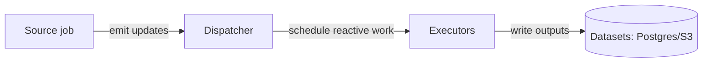

# Data ingestion

Status: Draft
Owner: Platform
Last updated: 2026-01-02

## Summary
Ingestion defines how onchain and offchain data enters Trace. Ingestion is implemented as operators (source and reactive jobs) that write to versioned datasets (Postgres hot tables and/or S3 Parquet) with reorg-safe semantics.

## Risk
Low

## Problem statement
We need standard, pluggable ingestion patterns for:
- following chain head with reorg handling,
- performing historical bootstrap sync (empty → tip) and bounded catch-up,
- ingesting offchain reference data,
while keeping ingestion logic outside the core platform and preserving idempotency under retries.

## Goals
- Treat ingestion as operators configured in DAG YAML, not special-case code.
- Support both:
  - realtime chain-tip ingestion, and
  - bounded historical range ingestion (backfills).
- Ensure ingestion outputs are compatible with the platform’s versioning/invalidation model.

## Non-goals
- A single ingestion tool standard for all sources (operators may vary).
- Exactly-once ingestion.

## Public surface changes
- Config semantics: DAG job configs for ingestion operators (see operator docs).
- Persistence: ingestion outputs are datasets (Postgres/S3) using the standard publishing and versioning model.

## Architecture (C4) — Mermaid-in-Markdown only

## Proposed design

### Onchain ingestion modes
- **Realtime (chain tip)**: a long-running source/operator follows chain head and produces new blocks/txs/logs and reorg invalidations.
  - Example: `block_follower` (writes to Postgres hot tables; reorg-aware).
- **Historical (bounded ranges)**: batch/range ingestion writes immutable outputs to S3 (Parquet), typically followed by compaction/finalization steps.
  - Example: `cryo_ingest` + downstream `parquet_compact`.

### Offchain ingestion
Offchain feeds (price data, labels, external APIs) enter via **source jobs at DAG entry points**. External data ingestion is not embedded mid-job.

### Reorg and correctness
Ingestion operators MUST:
- emit deterministic idempotency keys for append-style sinks,
- integrate with invalidation/versioning where applicable (see `docs/architecture/data_versioning.md`),
- tolerate task retries and duplicate scheduling.

## Contract requirements
- Ingestion jobs MUST follow the standard task lifecycle (heartbeat/complete) and idempotent commit semantics.
- Outputs MUST be written using `append` + `unique_key` or `replace` semantics as declared in the DAG.

## Security considerations
- Ingestion code may need provider credentials (RPC keys). Credentials are injected via platform secret handling; untrusted code must not gain broad AWS perms (see `docs/standards/security_model.md`).

## Alternatives considered
- Hardcode ingestion into the platform.
  - Why not: locks in specific tools; increases core surface area.

## Bootstrap sync (historical ingestion)

Trace does not have a special “backfill” primitive. Historical sync is modeled as normal jobs over a bounded range:

- A range manifest (e.g., `start_block..end_block`) is emitted by an external system or a source operator.
- `range_splitter` fans out the range into partitions (`chunk_size`).
- Batch operators (e.g., `cryo_ingest`) process partitions in parallel, capped by `scaling.max_concurrency` if set.
- Heavy RPC throughput is scaled by configuring an `rpc_pool` with multiple provider endpoints/keys in the RPC Egress Gateway (do not embed API keys in DAG YAML).

## Acceptance criteria
- Tests:
  - Realtime ingestion survives retries without duplicate rows (idempotent append).
  - Bootstrap (historical) ingestion produces deterministic output paths/manifests (replace semantics).
- Observable behavior:
  - Lag metrics (head minus cursor) and reorg counters are visible for source operators.

## Related
- Operator docs:
  - `docs/architecture/operators/block_follower.md`
  - `docs/architecture/operators/cryo_ingest.md`
  - `docs/architecture/operators/parquet_compact.md`
  - `docs/architecture/operators/integrity_check.md`
- Versioning: `docs/architecture/data_versioning.md`
