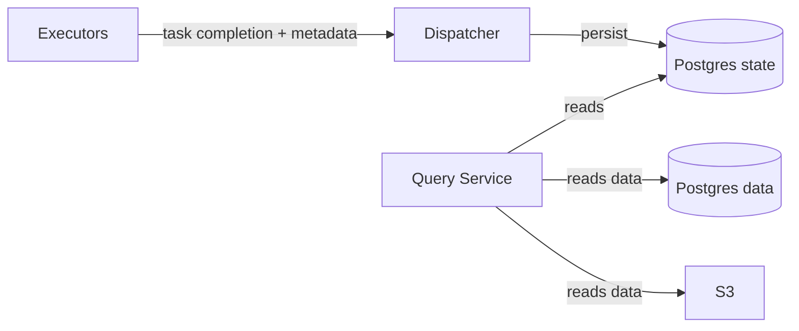

# Metadata and lineage

Status: Draft
Owner: Platform
Last updated: 2026-01-11

## Summary
Trace records lineage and run metadata for jobs, tasks, datasets, partitions, and dataset versions. This metadata supports discovery, debugging, rollback/query pinning, and operational visibility.

## Doc ownership

This spec is a link-first index for metadata and lineage.

Canonical related docs:
- Task and retry semantics (at-least-once): [task_lifecycle.md](../architecture/task_lifecycle.md)
- Postgres state vs data boundary: [db_boundaries.md](../architecture/db_boundaries.md)
- Dataset publishing and registry: [ADR 0008](../adr/0008-dataset-registry-and-publishing.md)
- Atomic cutover and query pinning: [ADR 0009](../adr/0009-atomic-cutover-and-query-pinning.md)
- Versioning and invalidations: [data_versioning.md](../architecture/data_versioning.md)
- User-facing dataset routes: [user_api_contracts.md](../architecture/user_api_contracts.md)
- Task-scoped write paths for metadata (task completion, publishing): [task_scoped_endpoints.md](../architecture/contracts/task_scoped_endpoints.md)
- Schema mapping docs: [data_model/README.md](../architecture/data_model/README.md)
- Canonical schema source of truth: `harness/migrations/state/` and `harness/migrations/data/`

## Risk
Low

## Problem statement
Users and operators need to answer:
- what produced this dataset version?
- what inputs did it use?
- what ran, when, and why did it fail?
without scraping logs or reconstructing state from S3.

Constraints are owned elsewhere:
- At-least-once execution and idempotent completion: [task_lifecycle.md](../architecture/task_lifecycle.md)
- State vs data boundaries and soft references: [db_boundaries.md](../architecture/db_boundaries.md)

## Goals
- Provide a consistent metadata model for:
  - datasets and dataset versions,
  - partitions/materializations,
  - task execution history,
  - operator-provided custom metadata.
- Support query pinning and atomic cutover for S3-backed datasets.

## Non-goals
- A full graph query language in v1.
- User-defined metadata schemas beyond JSON.

## Public surface changes
- Query surfaces: dataset registry + version pinning behaviors (see [ADR 0008](../adr/0008-dataset-registry-and-publishing.md) and [ADR 0009](../adr/0009-atomic-cutover-and-query-pinning.md)).
- User API: dataset discovery and metadata routes are defined in [user_api_contracts.md](../architecture/user_api_contracts.md).
- Task-scoped writes: the metadata write paths used during task completion are defined in [task_scoped_endpoints.md](../architecture/contracts/task_scoped_endpoints.md).
- Persistence: metadata tables in Postgres state and (where applicable) Postgres data (canonical DDL: `harness/migrations/`).

## Architecture (C4) - Mermaid-in-Markdown only

## Proposed design

### What the system tracks
At minimum:
- **Organizations and users** (identity and ownership; see [security.md](../architecture/security.md)).
- **DAG versions** and the active DAG mapping (see [dag_deployment.md](../architecture/dag_deployment.md)).
- **Jobs and tasks** including attempt history, leases, and failure reasons (see [task_lifecycle.md](../architecture/task_lifecycle.md)).
- **Datasets** (registry mapping from name to UUID, see [ADR 0008](../adr/0008-dataset-registry-and-publishing.md)).
- **Dataset versions** and published pointers (atomic cutover, query pinning, see [ADR 0009](../adr/0009-atomic-cutover-and-query-pinning.md)).
- **Partitions/materializations** for datasets that are partitioned.
- **Custom metadata** (JSON) emitted by operators and stored with materializations.

### Versioning and rollback semantics
- Dataset registry and publishing: [ADR 0008](../adr/0008-dataset-registry-and-publishing.md)
- Atomic cutover and query pinning: [ADR 0009](../adr/0009-atomic-cutover-and-query-pinning.md)
- Partition versioning and invalidations: [data_versioning.md](../architecture/data_versioning.md)

V1 constraint (be explicit):
- Atomic cutover/rollback semantics apply to **version-addressed outputs** (e.g., S3 manifests + pointers).
- Postgres “hot” tables are treated as live mutable state unless versioned views/tables are implemented.

### Data model references
Canonical DDL lives in:
- `harness/migrations/state/`
- `harness/migrations/data/`

Schema mapping docs live in:
- [data_model/README.md](../architecture/data_model/README.md)
- [orchestration.md](../architecture/data_model/orchestration.md)
- [data_versioning.md](../architecture/data_model/data_versioning.md)
- [address_labels.md](../architecture/data_model/address_labels.md)
- [pii.md](../architecture/data_model/pii.md)

## Contract requirements
- Dispatcher MUST be the system of record for task lifecycle and dataset version commits.
- Task completion MUST be idempotent: duplicate completions MUST NOT create duplicate materializations/versions.
- Cross-DB identifiers (`org_id`, `job_id`, `task_id`) stored in Postgres data MUST be treated as soft refs; trusted writers validate them at write time (see [db_boundaries.md](../architecture/db_boundaries.md)).

## Security considerations
- Metadata is multi-tenant and may contain sensitive derived fields. Apply the same authz rules as data access:
  - user JWT auth for user-facing queries,
  - capability tokens for task-scoped queries,
  - no direct Postgres access for untrusted runtimes.

## Alternatives considered
- Store lineage only in S3 manifests.
  - Why not: hard to query and join with runtime/task history; pushes complexity into every consumer.

## Acceptance criteria
- Tests:
  - dataset publish creates a discoverable registry entry with stable UUID mapping.
  - task completion produces exactly one materialization record per idempotency key.
- Observable behavior:
  - Operators can locate the job/task that produced a dataset version and its inputs.
