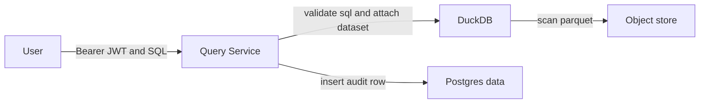

# Query Service: User Query API

Status: Implemented
Owner: Platform
Last updated: 2026-01-09

## Summary
Add a minimal user-facing `POST /v1/query` endpoint to Query Service so a human can run validated, read-only SQL against an authorized dataset. The endpoint is intentionally a thin wrapper around `trace_core::query::validate_sql`, trusted dataset attach, and dataset-level audit logging.

## Risk
High

This is a new public endpoint that executes untrusted SQL and introduces a new authn context (user principal).

## Related ADRs
- ADR 0008 (Dataset Registry + Publishing)
- ADR 0009 (Atomic cutover and query pinning)
- ADR 0002 (Networking, no egress by default)

## Context
Today Query Service implements only task-scoped queries (`POST /v1/task/query`) gated by a task capability token.

We need a user query surface to enable interactive inspection after a local sync without relying on task-only capability tokens.

For Lite, user authn is dev-only and uses an HS256 JWT. AWS/OIDC integration is out of scope here.

## Goals
- Provide `POST /v1/query` for user-scoped interactive reads.
- Keep SQL execution fail-closed using `trace_core::query::validate_sql`.
- Keep dataset attach fail-closed and bounded by dataset grants and object-store prefix grants.
- Emit a dataset-level audit record without storing raw SQL.

## Non-goals
- Dataset registry lookup by dataset name.
- Pagination, exports, caching, or persisted query results.
- Any non-SELECT SQL or multi-statement queries.
- OIDC/JWKS verification (Lite uses HS256 only).

## Public surface changes
- Endpoints/RPC:
  - Add `POST /v1/query` (user Bearer JWT auth)
- Events/schemas:
  - None
- CLI:
  - None
- Config semantics:
  - Add Query Service config for verifying user Bearer JWTs (Lite HS256)
- Persistence format/migration:
  - Add `data.user_query_audit` (dataset-level audit, no raw SQL)
- Entrypoint exports:
  - None (extend existing `trace-query-service` binary)
- Intentionally not supported (surface area control):
  - Result exports, async queries, multi-dataset attach, and any non-SELECT SQL

## Architecture (C4) - Mermaid-in-Markdown only

## Proposed design

### Responsibilities and boundaries
- Query Service
  - Verifies `Authorization: Bearer <user_jwt>` (Lite HS256).
  - Validates SQL with `trace_core::query::validate_sql` on every request.
  - Attaches exactly one dataset as a stable relation `dataset` in trusted code.
  - Executes untrusted SQL only against attached relations.
  - Inserts a dataset-level audit row and does not store raw SQL.
- `trace-core`
  - Owns `query::validate_sql`.
  - Owns dataset grant types (`DatasetGrant`, `DatasetStorageRef`, `S3Grants`).

### Data flow and trust boundaries
- Untrusted inputs:
  - Request JSON (`dataset_id`, `sql`, `limit`)
  - User Bearer JWT
- Validation points:
  - JWT signature and expiry, plus required claims.
  - Dataset grant check: request `dataset_id` must be present in token grants.
  - Storage authz check: dataset storage ref must be present and within token S3 read prefixes.
  - SQL gate: `validate_sql` must pass before execution.
- Sensitive data handling:
  - Logs and error responses must not include raw SQL or the JWT.
- Failure modes:
  - 401: missing/invalid user token
  - 403: dataset not granted or storage ref not authorized
  - 400: SQL rejected by gate
  - 500: DuckDB errors or audit write failure

## Contract requirements
- MUST require `Authorization: Bearer <user_jwt>`.
- MUST reject missing/invalid tokens (401).
- MUST reject requests for datasets not granted in the token (403).
- MUST reject if the granted dataset storage reference is missing or outside token S3 read prefixes (fail closed).
- MUST call `trace_core::query::validate_sql` before execution and reject failures (400).
- MUST clamp `limit` to `[1, 10_000]` (default 1000) and return `truncated` when clipped.
- MUST write a dataset-level audit row on successful execution without storing raw SQL.

## Compatibility and migrations
- Backwards compatibility expectations:
  - Existing task query endpoint remains unchanged.
- Migration plan:
  - Add a new `data.user_query_audit` table via harness data migrations.
- Rollback implications:
  - Disabling the new endpoint is safe; audit table can remain unused.

## Security considerations
- Threats:
  - SQL bypass leads to file or network access via DuckDB.
  - Query endpoint used for data exfiltration.
- Mitigations:
  - Primary control is `validate_sql` (fail closed).
  - Defense-in-depth is DuckDB runtime hardening plus an egress allowlist that permits only the object store endpoint.
  - Dataset storage refs are authorized by prefix grants (fail closed).
- Residual risk:
  - Validator incompleteness; mitigated by runtime hardening and tests.

## High risk addendum

### Observability and operability
- Logs:
  - MUST record allow/deny outcomes and attach failures.
  - MUST NOT log raw SQL or JWTs.

### Rollout and rollback
- Rollout steps:
  - Implement endpoint with tests and keep existing task query endpoint unchanged.
- Rollback strategy:
  - Remove route or disable via deployment routing; no data-plane mutation beyond audit rows.
- Feature flags/config:
  - Avoid new flags. HS256 config is Lite-only and does not imply AWS prod auth.

## Reduction pass
- Avoided a second SQL validator in the service; `validate_sql` remains the single gate.
- Avoided exports, pagination, dataset discovery, and async query execution.
- Reused the existing attach path and manifest-only fetch invariant.

## Alternatives considered
- Alternative: skip authz and allow all datasets in Lite.
  - Why not: it does not prove dataset-level authorization boundaries.
- Alternative: implement dataset registry lookup and user role checks now.
  - Why not: this expands ms scope; registry and publishing semantics are tracked separately.

## Acceptance criteria
- Tests:
  - Auth required: missing token is 401.
  - Dataset grants enforced: ungranted dataset is 403.
  - Gate enforced: INSTALL/LOAD/ATTACH and external readers are rejected with 400.
  - Overblocking check: `SELECT 'https://example.com'` is allowed.
  - Successful query returns deterministic data from an attached Parquet fixture dataset.
  - Audit row inserted on success and does not store raw SQL.
- Observable behavior:
  - `POST /v1/query` returns JSON `{columns, rows, truncated}` on success.
