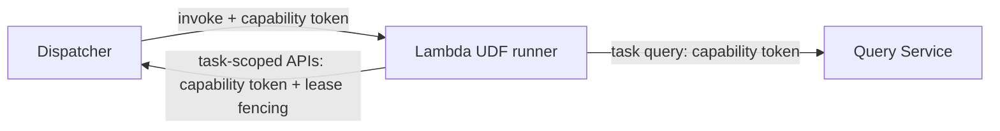

# User-defined functions

Status: Draft
Owner: Platform
Last updated: 2026-01-02

## Summary
UDFs are user-supplied code bundles executed by the platform to implement alert conditions and (later) custom transforms/enrichments. UDFs are treated as **untrusted** and interact with the platform only through task-scoped APIs authenticated by a per-attempt **task capability token**.

## Risk
High

UDFs change trust boundaries and introduce arbitrary code execution.

## Problem statement
Users want custom logic without the platform hardcoding every rule/transform. We need a design that:
- supports multiple languages,
- is safe under zero trust,
- is operable in AWS without per-task IAM role explosions.

Constraints:
- User code is untrusted in all runtimes, including `runtime: lambda`.
- Task execution is at-least-once; UDFs must be idempotent or emit deterministic idempotency keys.
- UDFs must not hold long-lived secrets or broad AWS permissions.

## Goals
- Execute untrusted UDF bundles with minimal privileges.
- Allow UDFs to read inputs via Query Service and write outputs via task-scoped publish APIs.
- Support a platform-managed Lambda runner for v1 (good isolation, low ops).
- Keep the security model identical across AWS and Trace Lite profiles.
- Allow a single DAG to mix languages (different jobs can use different UDF bundles).

## Non-goals
- Allowing UDFs to make arbitrary outbound network calls.
- Allowing UDFs to connect directly to Postgres.
- Supporting long-running UDF jobs that require hours of continuous execution (v1).

## Public surface changes
- Config semantics: `runtime: lambda` is allowed for UDF jobs and is executed via a platform-managed runner.
- Persistence format: UDF bundle format and provenance requirements.
- User API: bundle upload and metadata routes are enumerated in [user_api_contracts.md](../architecture/user_api_contracts.md).

## Architecture (C4) - Mermaid-in-Markdown only



## Proposed design

### Runtime model (v1)
- `runtime: lambda` executes UDF bundles inside a **platform-managed Lambda runner**.
  - The runner is **VPC-attached** in private subnets (no NAT) so it can reach internal-only services (Dispatcher/Query Service) without exposing them publicly.
  - Required AWS APIs (S3 for pre-signed bundle fetch, STS/KMS if used) are reached via VPC endpoints.
  - The runner fetches the bundle via a **pre-signed URL** minted by Dispatcher.
  - The runner receives a per-attempt **task capability token** plus `{task_id, attempt, lease_token}` in the invocation payload.
  - The runner uses the capability token for:
    - Query Service reads (`/v1/task/query`),
    - scoped credential minting (`/v1/task/credentials`),
    - fenced heartbeats/completions/events (`/v1/task/*`).
  - The runner Lambda execution role is near-zero (logs + networking only). It should not have broad S3/SQS/Secrets permissions.
- Invocation is abstracted via `trace_core::runtime::RuntimeInvoker` so the same payload and callback semantics apply across profiles.
  - Lite profiles use local invokers (`LocalProcessInvoker` and `FakeRunner`) without changing Dispatcher contracts.
  - AWS profiles use `trace_core::aws::AwsLambdaInvoker` behind the `aws` feature.

> The **worker token** is not a task-scoped credential. It is reserved for trusted ECS worker wrappers calling `/internal/*` endpoints.
> For `runtime: lambda` there is no wrapper boundary; Lambda must use the capability token only and must not call `/internal/*`.

### Language support (v1)
UDF bundles are Lambda-style zip artifacts. v1 supports three language families:

- **Node.js (JavaScript/TypeScript)**
  - TypeScript is compiled to JavaScript and runs on the Node runner.
- **Python**
- **Rust (Lambda custom runtime)**
  - Bundle contains a `bootstrap` executable.
  - Recommended tooling: use `cargo-lambda` (or equivalent AWS Lambda Rust tooling) to build a custom runtime zip that places `bootstrap` at the archive root.

A single DAG can run multiple languages by referencing different bundle IDs in different jobs.

**Runner selection:** the Dispatcher chooses the appropriate runner implementation based on bundle metadata (language/runtime) stored at bundle upload time.

### Referencing bundles in DAG config
A DAG job that runs user code MUST include an `udf` block:

```yaml
- name: my_udf_job
  activation: reactive
  runtime: lambda
  operator: udf
  outputs: 1
  inputs:
    - from: { dataset: some_dataset }
  update_strategy: append
  unique_key: [dedupe_key]
  udf:
    bundle_id: "<bundle-id>"
    entrypoint: "trace.handler"  # required for python/node; ignored for rust custom runtimes
```

- `bundle_id` is the immutable identifier of a previously uploaded bundle.
- `entrypoint` is the handler function inside the bundle when the language runtime supports it.

### Bundle format and provenance
- Bundle format and entrypoints are defined in [ADR 0003](../adr/0003-udf-bundles.md).
- Bundles are immutable artifacts and MUST be pinned by a content hash (SHA-256).
- Bundle upload associates the bundle with an org + user for auditability.

### Data access
- UDFs read data via Query Service using the capability token. Query Service enforces dataset/version pinning and org scoping.
- If a UDF needs to read/write S3 artifacts directly, it requests scoped credentials via task-scoped APIs (short-lived, prefix-scoped).

### Output and idempotency
- UDF outputs must use declared semantics:
  - `replace`: write attempt-scoped artifacts, commit via Dispatcher
  - `append`: emit deterministic keys and rely on sink upsert semantics
- UDFs MUST NOT emit attempt-derived idempotency keys (those change on retry). Idempotency keys must be derived from domain data (or a stable upstream cursor key).

### ECS UDF (v2) hurdle (zero-trust requirement)
Before untrusted `ecs_udf` is supported, the design MUST prevent untrusted code from inheriting privileged AWS credentials (e.g., SQS poller creds) and must retain:
- task-scoped capability tokens,
- no direct Postgres access,
- bounded AWS permissions per execution.

## Contract requirements
- UDFs MUST be treated as untrusted in all runtimes.
- UDFs MUST authenticate only via the per-attempt capability token over TLS (no hidden shared secrets).
- UDFs MUST NOT have direct Postgres connectivity.
- The platform MUST provide clear failure reporting (stderr, structured error) without leaking secrets.

## Security considerations
- Threats: arbitrary code execution, token exfiltration, data exfiltration, denial of service.
- Mitigations:
  - near-zero IAM roles for UDF runner,
  - task-scoped short-lived JWTs + lease fencing,
  - no network egress to third parties,
  - resource limits and timeouts.
- Residual risk: user code can still burn CPU/memory; mitigated with quotas and timeouts.

## Alternatives considered
- mTLS client auth for task-scoped endpoints.
  - Why not: untrusted runtimes cannot safely hold client certs; operationally heavy.
- Give UDFs broad IAM permissions and rely on policy.
  - Why not: violates least privilege and makes abuse harder to contain.

## Acceptance criteria
- Tests:
  - UDF runner can execute a bundle and query data only permitted by its capability token.
  - UDF cannot access Secrets Manager or arbitrary S3 prefixes.
  - Duplicate UDF retries do not create duplicate outputs (idempotent append or replace commit).
- Observable behavior:
  - Per-run logs/metrics exist; token issuance/validation failures are visible.
