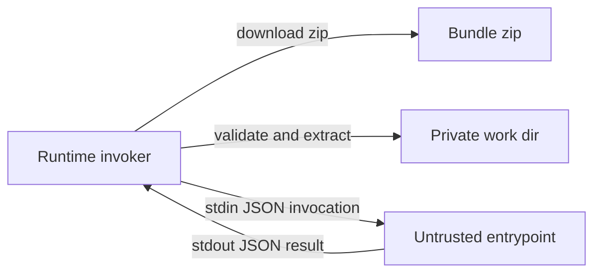

# UDF Bundle Manifest

Status: Draft
Owner: Platform
Last updated: 2026-01-09

## Summary
Define a trace-owned `bundle_manifest.json` inside UDF zip bundles so trusted runners can validate and extract bundles safely (fail-closed) before executing untrusted code.

## Risk
Medium

This introduces untrusted input parsing and local code execution, but it is gated behind opt-in runtime modes and strict size and path caps.

## Related ADRs
- ADR 0003 (UDF Bundles)

## Context
Today, Trace Lite uses harness-specific runner logic and ad hoc "bundle" JSON blobs. We need a real bundle artifact model that:
- supports multiple runtimes,
- is safe under retries and restarts,
- is validated fail-closed at a single boundary,
- can be reused by both Lite and AWS runner implementations later.

## Goals
- Provide a strict, versioned manifest format for UDF bundles.
- Enable safe extraction (no zip-slip), bounded resource use, and deterministic validation.
- Support multi-language runtimes: Node and Python first.

## Non-goals
- Bundle signing and public key distribution.
- User-facing bundle upload APIs.
- Full UDF output contracts (publish/complete semantics are defined elsewhere).

## Public surface changes
- Persistence format/migration:
  - New file inside the UDF bundle zip: `bundle_manifest.json` (required for runners that execute bundles).
- Config semantics:
  - Runners MAY add configuration for bundle limits (max bytes, max files, timeouts).
- Intentionally not supported (surface area control):
  - No dynamic dependency installation at runtime (no `npm install`, no `pip install`).
  - No extracting files outside a private work directory.

## Architecture (C4) - Mermaid-in-Markdown only

## Proposed design

### Manifest file
- Bundle container format: zip.
- The bundle MUST contain a UTF-8 JSON file at the archive root: `bundle_manifest.json`.
- The manifest is treated as untrusted input and MUST be validated before any files are written to disk.

### Manifest schema (v1)
The manifest is versioned and strict (`deny_unknown_fields`).

- `schema_version` (int): MUST be `1`.
- `runtime` (string enum): `node` or `python` (v1).
- `entrypoint` (string): relative path to the file executed by the runtime.
- `files` (array):
  - `path` (string): relative path inside the bundle.
  - `sha256` (string): lowercase hex SHA-256 of the file contents.
  - `bytes` (int): uncompressed byte length of the file.
- `env_allowlist` (optional array of strings): names of environment variables the runner MAY pass through.

### Validation and caps
Trusted runners MUST validate:
- manifest size is capped (max bytes).
- `files.len` is capped.
- `bytes` is capped per file and in total.
- path safety:
  - MUST NOT be absolute
  - MUST NOT contain `..` path traversal segments
  - MUST NOT contain backslashes
  - MUST NOT contain NUL bytes
- the `entrypoint` MUST be a valid safe path and MUST exist in `files`.
- the zip MUST NOT contain any file entries not declared in `files` (excluding `bundle_manifest.json`).

### Extraction
- Extraction MUST be zip-slip safe: extracted paths MUST be joined to a private work dir using the validated relative `path` values only.
- Extraction MUST verify `sha256` and `bytes` for each extracted file.
- Extraction MUST create directories as needed under the private work dir and MUST NOT create symlinks.

## Contract requirements
- The runner MUST treat `bundle_manifest.json` and zip contents as untrusted input.
- The runner MUST validate and cap bundle size and file counts (fail closed).
- The runner MUST reject bundles with unsafe paths (fail closed).
- The runner MUST extract only files declared in the manifest and MUST verify hashes.
- The runner MUST execute the `entrypoint` in a private work dir.
- The runner MUST bound execution time and stdout/stderr bytes (fail closed).
- The runner MUST clean up extracted artifacts after execution.

## Security considerations
- Threats:
  - zip-slip writes outside the work dir
  - resource exhaustion via large bundles or large stdout
  - leaking secrets through inherited environment variables
- Mitigations:
  - strict path validation + extract-only-from-manifest
  - size caps on manifest, files, and stdout/stderr
  - runners SHOULD clear the environment by default and pass through only allowlisted variables

## Reduction pass
- Avoided options and modes:
  - no support for tarballs or mixed container formats
  - no dependency installs or extension loading at runtime
- Consolidated paths:
  - a single manifest file drives both validation and extraction
- Simplified invariants:
  - "extract only what the manifest declares" is the primary safety rule

## Alternatives considered
- No manifest, rely on zip layout conventions only.
  - Why not: trusted runners cannot enforce consistent safety caps and file allowlists without a manifest.
- Signed bundles only, no internal manifest.
  - Why not: signing is valuable but does not replace size caps and path safety checks.

## Acceptance criteria
- Tests:
  - manifest validation rejects unsafe paths and oversize bundles
  - extraction rejects extra undeclared files and hash mismatches
  - runner enforces bounded stdout and timeouts
- Observable behavior:
  - runner logs contain safe error categories and do not log raw bundle contents
