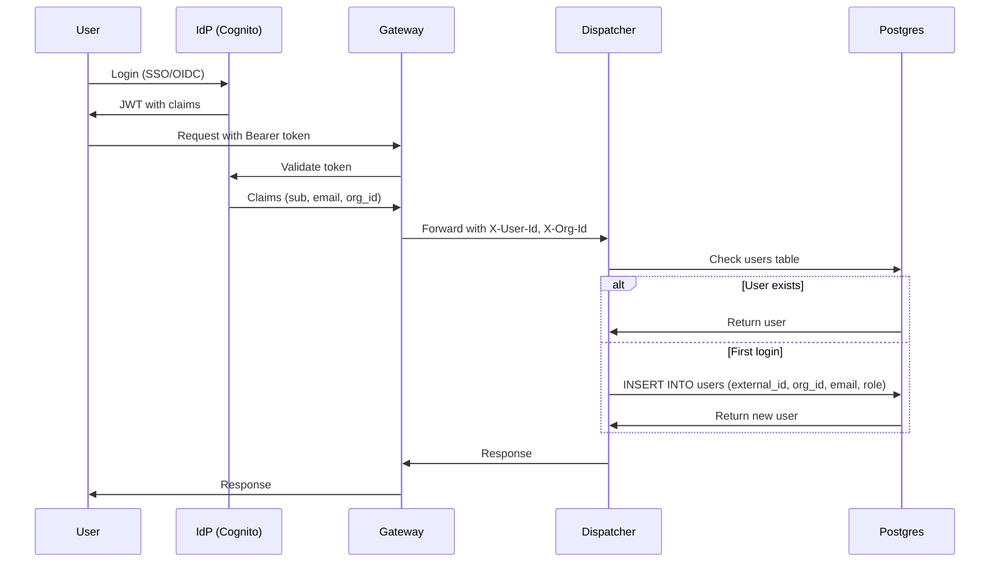

# Security

Security model for the Trace platform. This document is the single source of truth for security requirements.

## Principles

- **Least privilege**: every component (jobs, workers, services) receives only the permissions required for its function.
- **Defense in depth**: multiple layers of isolation (container, network, IAM, data).
- **Zero trust**: all user code is untrusted; all requests are authenticated and authorized.
- **Encryption everywhere**: data encrypted in transit (TLS 1.2+) and at rest (S3 SSE, RDS encryption).
- **No secrets in code or logs**: secrets injected at runtime, redacted from all logs and error messages.
- **Auditability**: all access and actions are logged and attributable to a user/job.

---

## Threat Model

- **Malicious code**: data exfiltration, crypto mining, lateral attacks.
- **Buggy code**: infinite loops, memory leaks, crashes.
- **Resource abuse**: CPU/memory exhaustion, cost runaway.
- **Data access violations**: reading other orgs' data, unauthorized PII access.

## Container Isolation

- Each job runs in its own Fargate task (no shared compute with other jobs or orgs).
- **No privileged mode**: containers cannot access host resources.
- **Read-only root filesystem**: writes only to designated output paths.
- **No IAM role assumption**: task role has minimal, scoped permissions.

### Secrets Injection

Worker wrapper fetches secrets from Secrets Manager and injects them as environment variables. Operator code reads secrets from env vars — it never calls Secrets Manager directly.

### Secrets Naming Convention

Secrets are stored in AWS Secrets Manager with a hierarchical path:

```
/{env}/{org_slug}/{secret_name}
```

| Component | Example | Description |
|-----------|---------|-------------|
| `env` | `prod`, `staging` | Deployment environment |
| `org_slug` | `acme` | Organization slug (from `orgs.slug`) |
| `secret_name` | `monad_rpc_key` | Name declared in DAG YAML |

**Example**: `/prod/acme/monad_rpc_key`

**DAG config**:
```yaml
jobs:
  - name: block_follower
    secrets: [monad_rpc_key]
```

**Worker behavior**:
1. Worker receives `secrets: ["monad_rpc_key"]` in task payload
2. Worker fetches `/{env}/{org_slug}/monad_rpc_key` from Secrets Manager
3. Worker injects as `MONAD_RPC_KEY` env var (uppercase, underscores)
4. Operator reads `std::env::var("MONAD_RPC_KEY")`

**Scoping**: In v1 (single-tenant), all secrets are under one org. Future multi-tenant deployments isolate secrets per org via IAM policies on the `/{env}/{org_slug}/*` path.

## Network Isolation

- Jobs run in a VPC with **no internet egress by default**.
- Allowlisted endpoints only:
  - S3 (via VPC endpoint)
  - RDS Postgres (via VPC endpoint)
  - SES/SNS (via VPC endpoint, for alert delivery)
  - Pre-approved webhook URLs (for alert delivery)
- User jobs cannot make arbitrary outbound HTTP calls.
- Platform jobs (e.g., `block_follower`, `cryo_ingest`) may access allowlisted RPC endpoints.
- No inbound connections to job containers.
- **TLS required**: all internal and external traffic uses TLS 1.2+.

## Resource Limits

- **CPU/memory**: hard caps in ECS task definition; job cannot exceed.
- **Execution timeout**: Worker terminates jobs exceeding max duration.
- **Disk quota**: ephemeral storage capped per task.
- **Rate limits**: max concurrent jobs and jobs-per-hour per org.
- **Cost alerts**: automated alerts when org approaches spend thresholds.

## Data Access Control

- **Scoped credentials**: each job receives credentials for only the datasets it's configured to read.
- **Org isolation**: queries are automatically filtered by `org_id`; jobs cannot access other orgs' data.
- **RPC access**:
  - **Platform jobs** (e.g., `block_follower`, `cryo_ingest`): may access allowlisted RPC endpoints.
  - **User jobs** (alerts, enrichments, custom transforms): query platform storage only, no raw RPC access.
- **PII gating**: jobs must be explicitly granted access to PII datasets; access is logged.

## Credential Handling

- Job receives short-lived, scoped tokens at execution time.
- Tokens grant:
  - Read access to declared input datasets.
  - Write access to declared output locations.
  - Invoke access to pre-approved webhook URLs.
- Tokens do not grant:
  - Access to other datasets.
  - IAM role assumption.
  - Secrets Manager access (secrets injected by Worker, not fetched by job).

## Audit and Monitoring

- All job executions logged: who, what, when, resource usage.
- All data access logged: datasets read, rows accessed.
- Anomaly detection: unusual resource consumption, access patterns.
- Abuse response: automatic job termination, org notification, potential suspension.
- **Secrets redacted**: all log outputs are scrubbed for secret patterns before persistence.
- **Retention**: audit logs retained for 1 year minimum (compliance).

## Encryption

- **In transit**: TLS 1.2+ for all connections (API, database, S3, internal services).
- **At rest**:
  - S3: SSE-S3 or SSE-KMS (configurable per bucket)
  - RDS: encrypted storage with AWS-managed or customer-managed KMS key
  - EBS: encrypted volumes for any ephemeral worker storage
- **Secrets**: stored in AWS Secrets Manager (encrypted at rest with KMS).

## User Onboarding Flow

Users authenticate via external IdP (Cognito with OIDC/SAML). On first login:



### JWT Claims

Expected claims from IdP:

| Claim | Maps To | Description |
|-------|---------|-------------|
| `sub` | `users.external_id` | Unique IdP subject identifier |
| `email` | `users.email` | User email (optional) |
| `custom:org_id` | `users.org_id` | Organization UUID |
| `custom:role` | `users.role` | Platform role: `reader`, `writer`, `admin` |

### Org Provisioning

In v1 (single-tenant), the org is pre-created via Terraform/migration. The `org_id` claim must match the deployed org.

Future multi-tenant: org provisioning via admin API or self-service signup.

## Security Operations (best-practice defaults)

- **Signing & provenance**: Container images and DAG bundles are signed (e.g., cosign) with SBOMs published; deployments verify signatures before pull/apply. (Refs: [SLSA](https://slsa.dev), [CNCF Supply Chain Best Practices](https://github.com/cncf/tag-security/blob/main/community/working-groups/supply-chain-security/supply-chain-security-paper/sscsp.md), [PDF](https://raw.githubusercontent.com/cncf/tag-security/main/community/working-groups/supply-chain-security/supply-chain-security-paper/CNCF_SSCP_v1.pdf))
- **Secrets & rotation**: Short-lived, scoped credentials per job/org; stored secrets rotate on a fixed cadence (e.g., ≤90d) and on key events; no Secrets Manager access from user code. (Refs: [NIST SP 800-57](https://csrc.nist.gov/publications/detail/sp/800-57-part-1/rev-5/final), [NIST SP 800-63](https://pages.nist.gov/800-63-3/))
- **Egress allowlist workflow**: Changes require review/approval; allowlist is IaC-managed; no ad-hoc outbound endpoints. (Refs: [AWS egress restriction guidance](https://docs.aws.amazon.com/whitepapers/latest/aws-vpc-connectivity-options/egress-only.html), [AWS SCPs](https://docs.aws.amazon.com/organizations/latest/userguide/orgs_manage_policies_scps.html))
- **PII handling**: Datasets classified; PII access requires explicit grant + logging; jobs touching PII must be tagged and are subject to heightened audit/retention. (Refs: [GDPR Art. 5(1)(c) data minimization](https://gdpr.eu/article-5-how-to-process-personal-data/), [ISO 27001 Annex A.8](https://www.iso.org/standard/27001))
