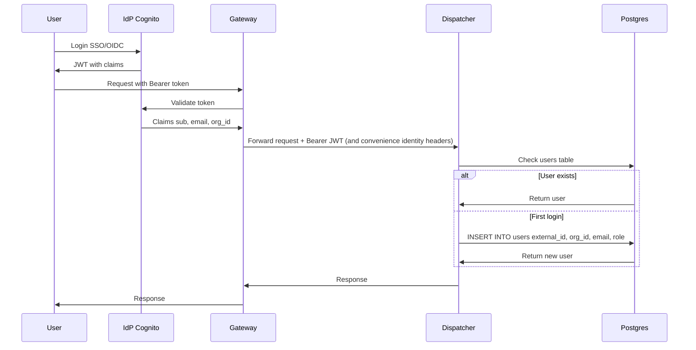

# Security

Security model for the Trace platform. This document is the single source of truth for security requirements.

## Principles

- **Least privilege**: every component (jobs, workers, services) receives only the permissions required for its function.
- **Defense in depth**: multiple layers of isolation (container, network, IAM, data).
- **Zero trust**: all user code is untrusted; all requests are authenticated and authorized.
- **Encryption everywhere**: data encrypted in transit (TLS 1.2+) and at rest (S3 SSE, RDS encryption).
- **No secrets in code or logs**: secrets injected at runtime, redacted from all logs and error messages.
- **Auditability**: all access and actions are logged and attributable to a user/job.

---

## Threat Model

- **Malicious code**: data exfiltration, crypto mining, lateral attacks.
- **Buggy code**: infinite loops, memory leaks, crashes.
- **Resource abuse**: CPU/memory exhaustion, cost runaway.
- **Data access violations**: reading other orgs' data, unauthorized PII access.

## Container Isolation

- Each job runs in its own Fargate task (no shared compute with other jobs or orgs).
- **No privileged mode**: containers cannot access host resources.
- **Read-only root filesystem**: writes only to designated output paths.
- **No IAM role assumption**: tasks do not assume arbitrary IAM roles at runtime.
  - **Untrusted UDF tasks** run with a near-zero-permission task role; they obtain scoped data access via capability tokens (see “Credential Handling”).
  - **Platform operators** (trusted code) run with a narrow platform task role appropriate for their function.

### Secrets Injection

Secrets are injected into job containers as environment variables by the platform at **task launch**.

- In AWS ECS/Fargate, secrets are referenced in the task definition and fetched by the **task execution role**.
- The **task role** does not need Secrets Manager access (and untrusted tasks must not have it).
- User/operator code reads secrets from environment variables and never calls Secrets Manager directly.

> **Design note:** ECS secret references are typically static in the task definition. For jobs that need distinct credentials per concurrent task (worker pools), the platform uses separate task definitions per slot (or another equivalent mechanism) so secrets remain injected by ECS rather than fetched dynamically by untrusted code.

### Secrets Naming Convention

Secrets are stored in AWS Secrets Manager with a hierarchical path:

```
/{env}/{org_slug}/{secret_name}
```

| Component | Example | Description |
|-----------|---------|-------------|
| `env` | `prod`, `staging` | Deployment environment |
| `org_slug` | `acme` | Organization slug (from `orgs.slug`) |
| `secret_name` | `monad_rpc_key` | Name declared in DAG YAML |

**Example**: `/prod/acme/monad_rpc_key`

**DAG config**:
```yaml
jobs:
  - name: block_follower
    secrets: [monad_rpc_key]
```

**Platform behavior (ECS)**:
1. During task launch, the platform resolves the secret reference (e.g., `/{env}/{org_slug}/monad_rpc_key`) into the ECS task definition `secrets` mapping.
2. ECS fetches the secret using the **task execution role** and injects it as an env var (e.g., `MONAD_RPC_KEY`).
3. Operator code reads `std::env::var("MONAD_RPC_KEY")`.

The secret **value** never appears in the task payload and untrusted code never receives credentials that can call Secrets Manager.

**Scoping**: In v1 (single-tenant), all secrets are under one org. Future multi-tenant deployments isolate secrets per org via IAM policies on the `/{env}/{org_slug}/*` path.

## Network Isolation

See [ADR 0002: Networking Posture](../architecture/adr/0002-networking.md).

- Job containers run in private subnets with **no direct internet egress**.
- Jobs may reach only:
  - required AWS APIs via VPC endpoints / PrivateLink (e.g., S3, SQS, ECR, CloudWatch Logs, Secrets Manager, KMS),
  - in-VPC platform services (Dispatcher, Query Service, sinks),
  - designated **egress gateway services** for external communication.
- Only the egress gateway services have a route to the public internet:
  - Delivery Service for outbound notifications/webhooks
  - RPC Egress Gateway (or in-VPC nodes) for blockchain RPC access
- Egress gateway services must prevent SSRF to internal networks (deny VPC CIDR/RFC1918/metadata IPs) and must audit outbound requests.
- Untrusted UDF tasks must not have a network path to Postgres (RDS) or Secrets Manager endpoints; they access hot storage only via Query Service.
- No inbound connections to job containers.
- **TLS required**: all internal and external traffic uses TLS 1.2+.
- **Internal APIs are authenticated** (do not rely on network placement alone):
  - **Task-scoped endpoints** (task heartbeat/completion/events, task query, credential minting) require a short-lived **task capability token** (JWT) plus lease fencing. These endpoints are safe to call from untrusted runtimes (`ecs_udf` and `lambda`).
  - **Worker-only endpoints** (task claim/fetch) are callable only by trusted worker wrappers and must be protected by security groups plus a worker identity mechanism (e.g., a worker token injected only into the wrapper container).
- **Lambda UDFs are supported**: if `runtime: lambda` executes user/UDF bundles, treat the entire Lambda as untrusted. Do not inject long-lived internal secrets; rely on task capability tokens + scoped, short-lived AWS credentials.


## Internal Service Authentication

Trace uses **three** distinct auth contexts. Keep them separate.

### 1) User API (end-user calls)

User-facing endpoints (e.g., `GET/POST /v1/...`) are authenticated with an OIDC JWT from the IdP.

- API Gateway should validate the JWT (rate limiting, WAF, request validation).
- **Backends must still treat the user JWT as the source of truth** for identity/role (defense in depth), because backend services are also reachable from inside the VPC.
- Forwarded identity headers (`X-Org-Id`, `X-User-Id`, etc.) are convenience only; they are **not** a security boundary by themselves.

### 2) Task-scoped APIs (untrusted compute)

Task-scoped endpoints are callable by untrusted runtimes (`ecs_udf` and `lambda`) and are authenticated with a per-attempt **task capability token** (JWT).

- The token is minted per `(task_id, attempt)` and expires quickly.
- Requests are additionally fenced by `{task_id, attempt, lease_token}` in the request body.
- Examples: task heartbeat, task completion, emitting upstream events, buffered dataset publish, task query, credential minting.

This gives **zero trust** properties without needing to hide secrets inside the runtime.

### 3) Worker-only APIs (queue pollers)

Some endpoints exist only because ECS workers poll the queue and must claim tasks before a capability token exists. These endpoints are called only by **trusted worker wrappers**.

- Protect them by **network policy** (security groups allow only the worker service) plus a **worker identity mechanism** (e.g., a worker token injected only into the wrapper container).
- Do not grant untrusted user code access to the worker identity.

> mTLS can be used as an optional hardening technique for trusted service-to-service calls, but it is **not required** for the v1 model and does not replace capability tokens for untrusted runtimes.

## Resource Limits

- **CPU/memory**: hard caps in ECS task definition; job cannot exceed.
- **Execution timeout**: Worker terminates jobs exceeding max duration.
- **Disk quota**: ephemeral storage capped per task.
- **Rate limits**: max concurrent jobs and jobs-per-hour per org.
- **Cost alerts**: automated alerts when org approaches spend thresholds.

## Data Access Control

- **Scoped credentials**: each job receives credentials for only the datasets it's configured to read.
- **Capability-based enforcement**: untrusted tasks receive a short-lived capability token that enumerates allowed datasets/versions and output locations. The token is enforced by Query Service (SQL reads) and the Dispatcher credential minting (scoped S3 credentials).
- **Org isolation**: queries are automatically filtered by `org_id`; jobs cannot access other orgs' data.
- **Dataset visibility**: dataset read access is enforced via the dataset registry (`datasets.read_roles`) and applies to Query Service reads and DAG-to-dag reads (`inputs: from: { dataset: ... }`).
  - If `read_roles` is empty: the dataset is private to the producing DAG’s deployers/triggerers plus org admins.
  - If `read_roles` is non-empty: those org roles also get read access (in addition to producing DAG deployers/triggerers + org admins).
  - `read_roles` is admin-managed in v1 (registry), not embedded in DAG YAML.
  - v1 does not implement “anti re-sharing” controls: if you grant someone dataset read access, they can use it in their own DAG (subject to their own DAG permissions).
- **DAG deploy/trigger permission**: permission to deploy/trigger a DAG implies permission to read and overwrite/create datasets produced by that DAG.
- **RPC access**:
  - **Platform jobs** (e.g., `block_follower`, `cryo_ingest`): access RPC providers only via the RPC Egress Gateway (or in-VPC nodes).
  - **User jobs** (alerts, enrichments, custom transforms): query platform storage only, no raw RPC access.
- **PII gating**: jobs must be explicitly granted access to PII datasets; access is logged.

## Credential Handling


Each task attempt receives short-lived, scoped credentials at execution time.

### Capability Token

For untrusted tasks (UDFs), the Dispatcher issues a short-lived **capability token** that encodes:

- `task_id`, `attempt`, `org_id`
- Allowed input dataset versions (resolved to pinned locations)
- Allowed output prefix (S3)
- Allowed scratch/export prefix (S3)
- Expiry

The token is passed to the worker wrapper via task payload and then to the UDF runtime (e.g., `TRACE_TASK_CAPABILITY_TOKEN`).

### Query Service Enforcement

UDFs issue ad-hoc SQL through Query Service using the capability token. Query Service attaches only the dataset views referenced by the token and rejects all other dataset access.

### Dispatcher credential minting

UDFs exchange the capability token with a Dispatcher credential minting service to receive short-lived STS credentials scoped to:

- Read access to the allowed input prefixes
- Write access to the allowed output prefix
- Read access to the task scratch/export prefix

The broker uses STS session policies to enforce prefix scoping. Credentials expire quickly and can be refreshed.

### Guarantees

This model grants:
- Read access only to declared/pinned input datasets
- Write access only to declared output locations

It does **not** grant:
- Access to other datasets
- Secrets Manager access (secrets are injected at launch)
- Direct Postgres access (UDFs must use Query Service)
- Internet egress (only platform egress services)

## Audit and Monitoring

- All job executions logged: who, what, when, resource usage.
- All data access logged: datasets read, rows accessed.
- Anomaly detection: unusual resource consumption, access patterns.
- Abuse response: automatic job termination, org notification, potential suspension.
- **Secrets redacted**: all log outputs are scrubbed for secret patterns before persistence.
- **Retention**: audit logs retained for 1 year minimum (compliance).

## Encryption

- **In transit**: TLS 1.2+ for all connections (API, database, S3, internal services).
- **At rest**:
  - S3: SSE-S3 or SSE-KMS (configurable per bucket)
  - RDS: encrypted storage with AWS-managed or customer-managed KMS key
  - EBS: encrypted volumes for any ephemeral worker storage
- **Secrets**: stored in AWS Secrets Manager (encrypted at rest with KMS).

## User Onboarding Flow

Users authenticate via external IdP (Cognito with OIDC/SAML). On first login:



### JWT Claims

Expected claims from IdP:

| Claim | Maps To | Description |
|-------|---------|-------------|
| `sub` | `users.external_id` | Unique IdP subject identifier |
| `email` | `users.email` | User email (optional) |
| `custom:org_id` | `users.org_id` | Organization UUID |
| `custom:role` | `users.role` | Platform role: `reader`, `writer`, `admin` |

### Org Provisioning

In v1 (single-tenant), the org is pre-created via Terraform/migration. The `org_id` claim must match the deployed org.

Future multi-tenant: org provisioning via admin API or self-service signup.

## Security Operations (best-practice defaults)

- **Signing & provenance**: Container images and DAG bundles are signed (e.g., cosign) with SBOMs published; deployments verify signatures before pull/apply. (Refs: [SLSA](https://slsa.dev), [CNCF Supply Chain Best Practices](https://github.com/cncf/tag-security/blob/main/community/working-groups/supply-chain-security/supply-chain-security-paper/sscsp.md), [PDF](https://raw.githubusercontent.com/cncf/tag-security/main/community/working-groups/supply-chain-security/supply-chain-security-paper/CNCF_SSCP_v1.pdf))
- **Secrets & rotation**: Short-lived, scoped credentials per job/org; stored secrets rotate on a fixed cadence (e.g., ≤90d) and on key events; no Secrets Manager access from user code. (Refs: [NIST SP 800-57](https://csrc.nist.gov/publications/detail/sp/800-57-part-1/rev-5/final), [NIST SP 800-63](https://pages.nist.gov/800-63-3/))
- **Centralized egress**: only platform egress gateway services have an internet route; outbound configuration changes are reviewed and deployed via IaC.
- **PII handling**: Datasets classified; PII access requires explicit grant + logging; jobs touching PII must be tagged and are subject to heightened audit/retention. (Refs: [GDPR Art. 5(1)(c) data minimization](https://gdpr.eu/article-5-how-to-process-personal-data/), [ISO 27001 Annex A.8](https://www.iso.org/standard/27001))
